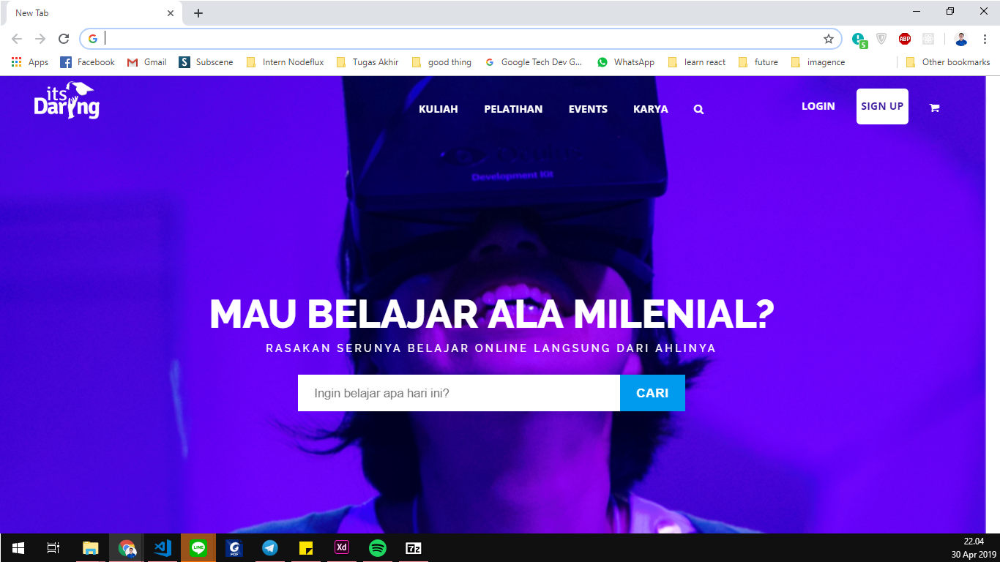
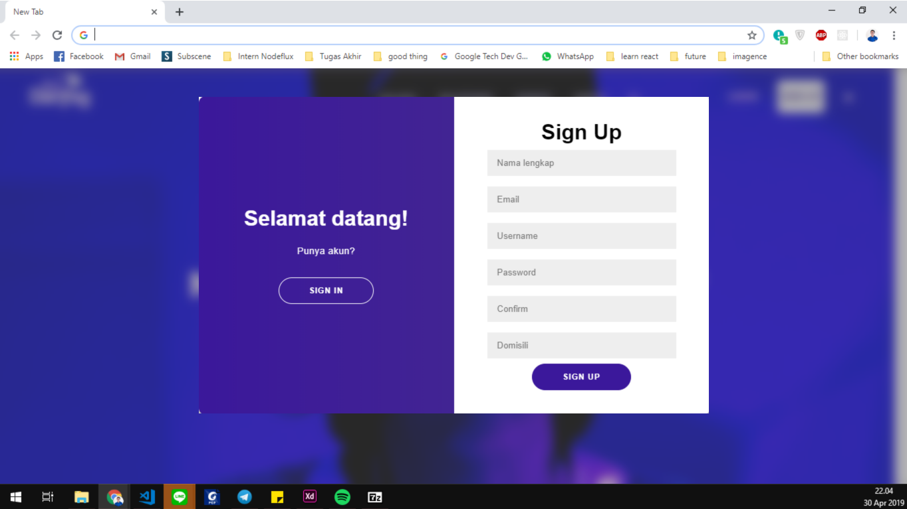
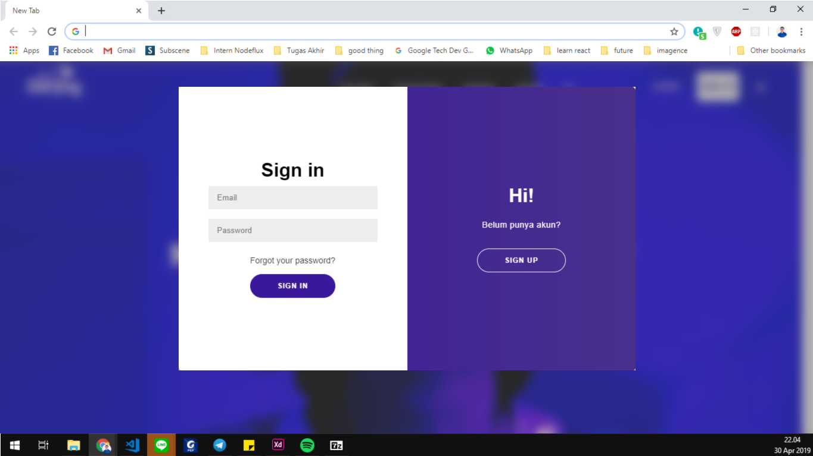
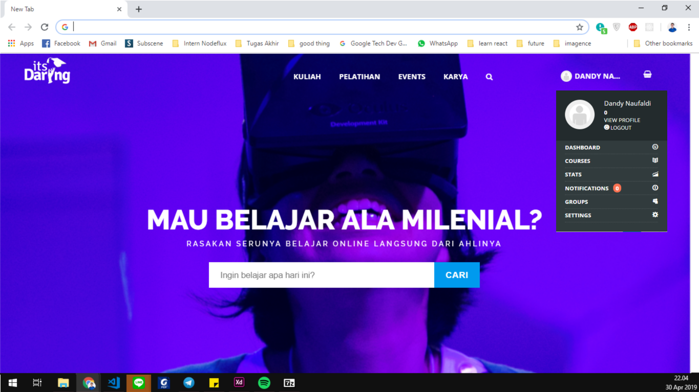
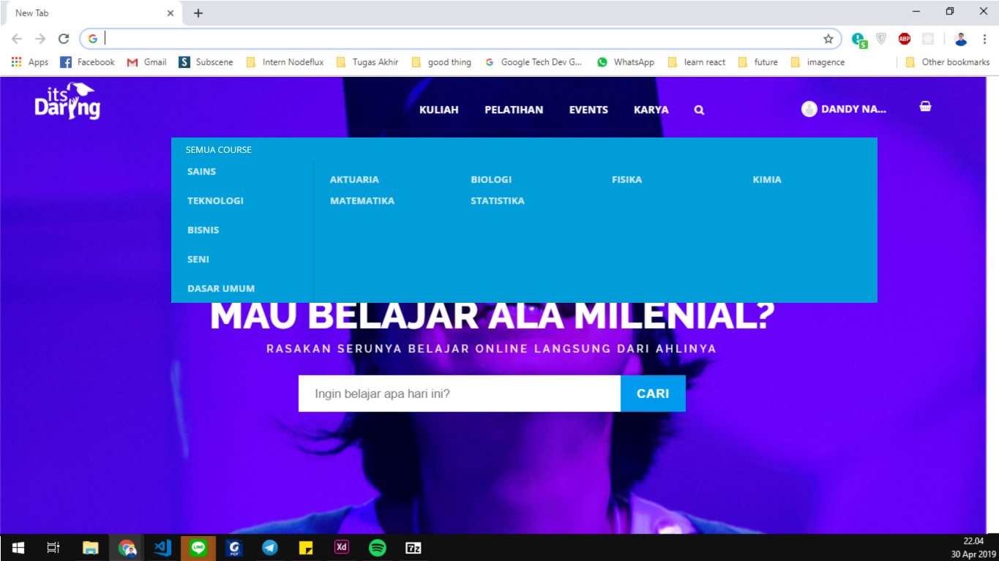
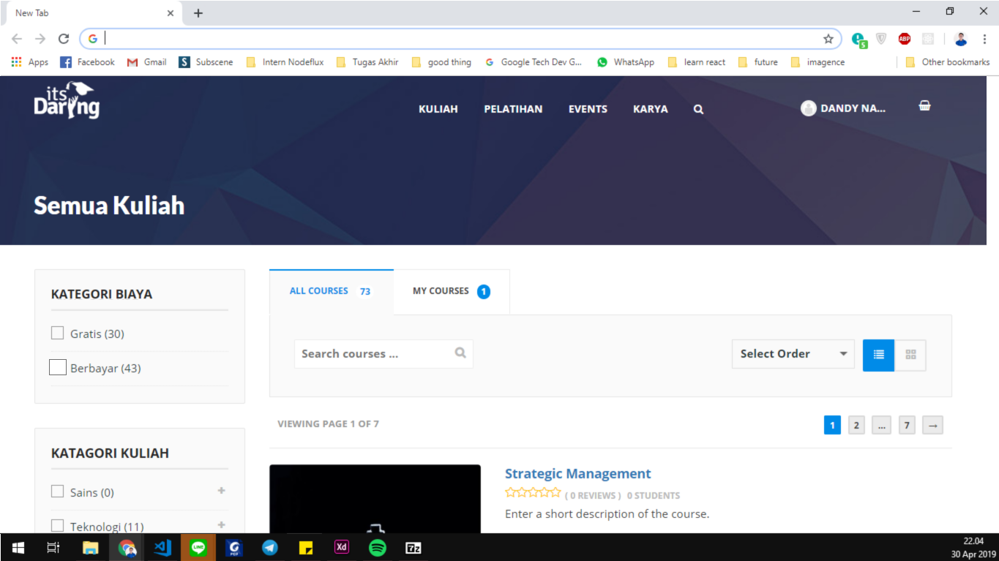
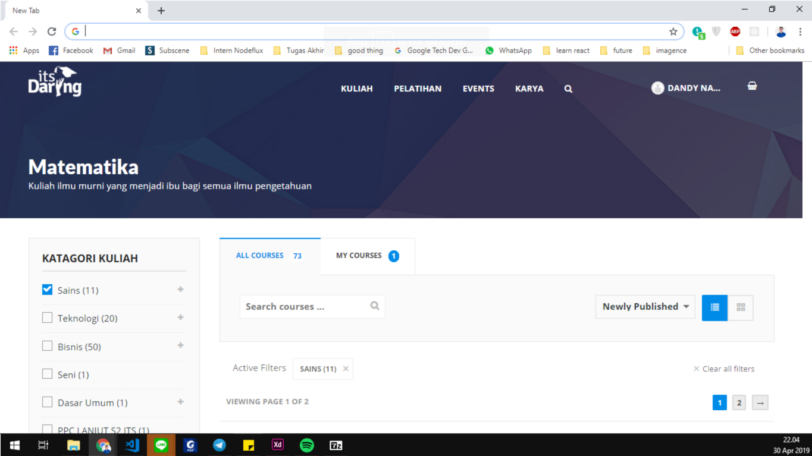
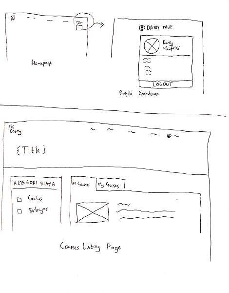

# Usability Evaluation and Prototyping (again)
> Usability Evaluation in this assignment is to evaluate your high-fidelity interactive-prototype with two participants:
> the participant from the previous Contextual Inquiry (CI) 
> and an additional novice-participant with different demographics if possible.
> Respectively, revise your prototype as an attempt to fix any problems found in this Usability Evaluation.

## Operating the Prototype
> Record a video (screen-recording is preferred) while you operating your prototype.
> Present the ideal case on how to interact with the prototype from the beginning to the end.
> Upload the video on any video-sharing website (e.g., YouTube), then attach the video link on this report.

---

## Part A: Usability Evaluation
> In this part, you should prepare your high-fidelity interactive-prototype from the assignment 2.
> Invite the participant from your previous CI to test the prototype.
> You also need to invite one more novice participant.
> As with the CI, you might need to videotape your sessions.
> You can benefit from the videotape while writing your `Recording Transcript` later.

### 1. Brief Description of Participants
> Describe your participants in bullets or sentences.
> The description should contain their demographic (age, gender, occupation),
> their skill level in using the system, and your reasons choosing them.
> The description should NOT contain any personally identifiable information.

#### a. Description of Participant 1
- Architecture student
- 21 years old
- Female
- Familiar with e-learning concept.
- Have used other website for e-learning purpose
- Familiar with account creation process on website. Have made around 10 online accounts on various websites.
- Used to browse the internet and use laptop on daily basis

#### b. Description of Participant 2
- Marine Engineering student
- 22 years old
- Male
- Quite familiar with e-learning concept
- Have used e-learning website (SHARE ITS)
- Used to browse internet for watching video and looking for online learning material

### 2. Evaluation Script
> Write the questions you ask and the instructions you use to direct the participants on what to do.
> If it is the same as previous assignments, please mention this, yet go ahead and INCLUDE it again,
> so we have everything in one place.
> Note that the evaluation script must include exactly what you plan to say to the participants.
#### Question
1.	Are you familiar with the concept of e-learning?
2.	Have you used any website for e-learning purpose?
3.	Are you familiar with account creation process in a website? If so, how many accounts you have created so far?

#### Instruction
1. Open [**itsdaring.id**](https://itsdaring.id/) then create an account.
2. After creating account, try to sign in then sign out.
3. Try to find 1 course from Mathematics category.
4. Try to find the list of free and paid courses.
### 3. Transcript
> Provide a summary of what the participant did and said, and what you did and said.
> If at some points you have to help the participants, because they cannot figure out what to do,
> that scene must be included in the transcript.
> It is not necessary to write down every word the participant said,
> just what is interesting and useful.
> Ensure to write down all the actions on the device, whether correct or wrong.
> Remember to supplement the transcript with time-codes or line-numbers.

#### a. Transcript with Participant 1
 1. **You**: Jadi yang sekarang ini nyobain prototype hasil perbaikan web yang dulu itu.
 2. **Participant**: Yang itsdaring itu ya?
 3. **You**: ya, ini prototype-nya, coba kamu lihat
 4. **Participant**: \*melihat-lihat homepage\*
 5. **You**: langsung aja ya, coba sign up bikin akun.
 6. **Participant**: aku kemarin belum bikin akun ya. \*klik sign up dan mencoba mengisi form \* 
 7. **You**: Itu (form) ga bisa diisi
 8. **Participant**: oo, ga bisa diisi?
 9. **You**: iya, ini cuma prototype, aslinya gambar-gambar aja.
 10. **Participant**: oo, gitu. Terus aku login?
 11. **You**: Iya.
 12. **Participant**: Oo, yayaya
 13. **You**: Terus setelah login, coba log out.
 14. **Participant**: Nah, udah.
 15. **You**: Gimana ada bedanya sama yang dulu?
 16. **Participant**: Enak yang ini sih, visualnya enak yang ini sama kalau sign up lebih gampang ga banyak klik-klik. Sama tombol login sama sign up enak dipisah gini sih, lebih jelas.
 17. **You**: Coba login lagi, terus cari course-nya matematika
 18. **Participant**: \*klik menu kuliah, pilih matematika\* Ya ya
 19. **You**: Kalau ini kan penataannya kuubah jadi alfabetis, menurutmu gimana?
 20. **Participant**: Kalo menurutku sih ga terlalu ngefek ya, aku juga masih nyari-nyari dulu
 21. **You**: Terus, kayak kemarin kan ada yang nyari course gratis sama berbayar. Nah sekarang kamu coba lagi.
 22. **Participant**: Hmm, lewat mana ya. Dulu itu ada tulisannya free sama ga kan ya?
 23. **You**: Iya, tapi itu kan di homepage.
 24. **Participant**: Hoo, ini tadi buka menu kuliah pilih matematika kan ya, kalau nampilin semuanya lewat mana ya?
 25. **You**: lihat-lihat isi menunya aja dulu
 26. **Participant**: Oh, ini ada 'semua course'. \*klik semua course di menu kuliah\*
 27. **You**: Terus gimana buat nampilih list yang free aja sama yang paid aja?
 28. **Participant**: Ini (filter di sidebar) pilih free. Nah, ini yang free aja. Terus pilih yang paid.
 29. **You**: Sip sip, gimana dibanding cara yang dulu?
 30. **Participant**: Ini lebih cepet sih, dulu kan scroll di homepage terus cari satu-satu buat lihat free atau berbayar. Habis ini ada lagi? 
 31. **You**: Udah itu aja sih.

#### b. Transcript with Participant 2
 1. **You**: Jadi, di sini aku bakal nunjukin 1 prototype dari web. Dia itu isinya gambar-gambar yang bisa dikasih aksi kayak klik-klik tombol, dll gitu
 2. **Participant**: oke, terus aku harus ngapain aja?
 3. **You**: pertama kamu coba sign up, terus logout. Sama login lagi.
 4. **Participant**: Sign up ini ya (menunjuk tombol sign up). Ok, bisa sign up.
 5. **You**: Sekarang coba logout terus login lagi
 6. **Participant**: Ok, \*klik nama user di kanan atas\*, mana logout-nya ya? Hmm, oh ini. Kok kecil gini ya. Susah nyarinya.
 7. **You**: iya ya, nanti dipindah deh, sekarang kamu login lagi ya.
 13. **Participant**: Ok, ini udah login lagi.
 8. **You**: sekarang, kamu coba cari list kuliah dari Matematika.
 9. **Participant**: Menu kuliah itu \*klik menu kuliah\*, terus ini Matematika. Terus ini gimana?
 10. **You**: Udah list-nya ya gitu aja sih. Terus di web ini kan yang namanya course itu ada 2 macam, gratis sama berbayar. Coba kamu dapetin list course yang gratis sama berbayar.
 11. **Participant**: Oh, di sini ada dua jenis gitu ya.. Cek di mana ya?.. \*mencari-cari\*
 12. **You**: Coba cari dulu aja.
 13. **Participant**: Iya ini, kebetulan juga ga semua tombol aktif kan ya. Tapi, ngeceknya di mana ini.
 14. **You**: Kalau di web aslinya tu cek di homepage, bisa keliahat semua course yang ada gitu, tapi di sini udah diubah, ga semua muncul di homepage.
 15. **Participant**: Gitu ya, hm apa harus lihat list semua course dulu?
 16. **You**: Mungkin, coba aja 
 17. **Participant**: Ini di menu kuliah ada semua course, coba ini ya.
 18. **Participant**: nah ini ada milih gratis sama berbayar \*menunjuk sidebar\*
 19. **You**: Terus gimana?
 20. **Participant**: Ini klik yang gratis, kalau berbayar klik yang berbayar
 21. **You**: Sip, bener
 22. **Participant**: Tapi tadi aneh ya, pas buka yang Matematika ga ada milih gratis/berbayar kayak ini, haruse ada semua
 23. **You**: Iya ya, nanti kutambahin deh
 24. **Participant**: Ada lagi ga?
 25. **You**: Udha itu aja sih.

### 4. Feedback and Incidence Analysis
> Record your observations per prototype screen followed by reference, feedback, incidence, reason, and resolution.

#### OBSERVATION 1 (Homepage - Login & Sign Up Button)

 - **Reference**: [#1, 16]
 - **Feedback**: Positive
 - **Incidence**: -
 - **Reason**: The separation of login and sign up button make things clearer.
 - **Resolution**: -
 
#### OBSERVATION 2 (Login & Sign up form)

 - **Reference**: [#1, 16]
 - **Feedback**: Positive
 - **Incidence**: -
 - **Reason**: Can do sign up faster because it's in the same place as the login form.
 - **Resolution**: - 
 
#### OBSERVATION 3 (Profile Dropdown)

 - **Reference**:  [#2, 6]
 - **Feedback**: Negative
 - **Incidence**: Participant hardly see the presence of logout button in the dropdown
 - **Reason**: The text is too small and doesn't look very different from its suroundings
 - **Resolution**: Move logout button to the bottom of profile dropdown and use different color to make it more eye-catching.
 
 ### OBSERVATION 4 (Course List Ordering)

  - **Reference**: [#1, 20]
 - **Feedback**: Positive kinda
 - **Incidence**: -
 - **Reason**: The change of ordering into alphabetical doesn't really affect anything at all
 - **Resolution**: -

#### OBSERVATION 5 (Free and Paid Course Filter)

- **Reference**: [#1, 30]
 - **Feedback**: Positive
 - **Incidence**: -
 - **Reason**: The presence of filter make the process faster, no need to scroll down on homepage
 - **Resolution**: - 

 - **Reference**: [#2, 22]
 - **Feedback**: Negative
 - **Incidence**: Participant can't find the filter when opening Mathematics courses page
 - **Reason**: The filter by paid/free have only applied to 'show all courses' page only.
 - **Resolution**: Implement the filter on all page that is showing list of courses
 ---

## Part B: Prototyping (again)
> Next, you will need to modify your prototype 
> based on the resolutions you have suggested in `Feedback and Incidence Analysis`'s observations.

### Sketch
> Draw a sketch of your prototype that is refined based according to the aforementioned observations on a paper.
> Afterwards, scan the sketch or make the photograph of it and attach it on this report's section.
> Please make sure the any texts on the sketch are readable.

### Design Rationale
> Please write a paragraph expressing what you have learned from the usability evaluation, 
> and how it is reflected in your design.

From the usability evaluation, I learned that everyone has different perspective / opinion regarding things. Just like, I get suggestion for logout button which is never complained by my first participant. With more participant for evaluation, we can get better understanding about what user want and need which really helps in a user centered design project. And, never forget that this is a repetitive process with improvement in every steps as we gather more user evaluation to improve our design and experience that we provide.

### High-Fidelity Interactive-Prototype
> Create a high-fidelity interactive-prototype based on the `Sketch` you have drawn.
> You can use any prototyping tools: InVision, Adobe XD, or even Microsoft PowerPoint.
